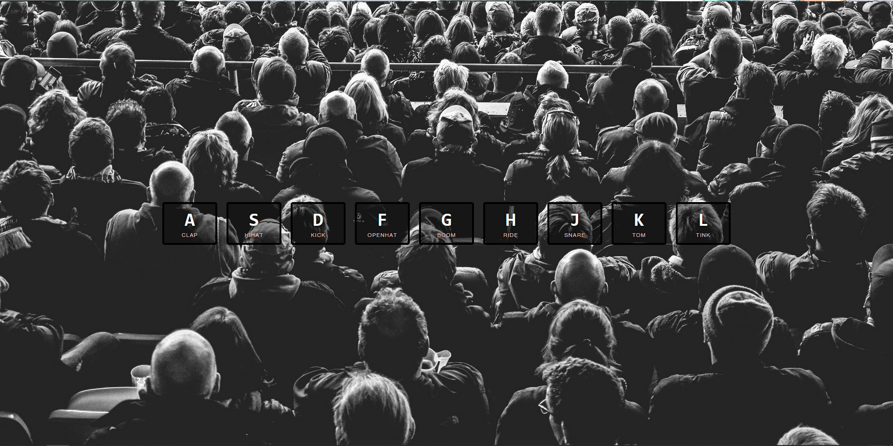

# JavaScript Drum Kit

This is the first of several projects I did as part of the 30 days of JavaScript exercises. Pressing the corresponding but plays a beat with visal cues.

## Table of contents

- [Overview](#overview)
  - [Screenshot](#screenshot)
  - [Links](#links)
- [My process](#my-process)
  - [Built with](#built-with)
  - [What I learned](#what-i-learned)
  - [Continued development](#continued-development)
  - [References](#references)
- [Author](#author)

## Overview

### Screenshot
|  
| ------------------------------ |
| Design Preview                |

### Links

- Live Site URL: [GitHub Pages Live URL](https://dayne2x.github.io/JavaScript-Drum-Kit/)

## My process

### Built with:

  
  
  

### What I learned

I learned about data-keys and first used "kbd" and "audio" input elements as well as arrow functions.

### Continued development

I will be doing more projects to further learn and improve.

### References

Project completed and inspired by the WesBos 30 Day JS Course.  

[Make a JavaScript Drum Kit in Vanilla JS! #JavaScript30 1/30](https://www.youtube.com/watch?v=VuN8qwZoego&list=PLu8EoSxDXHP6CGK4YVJhL_VWetA865GOH&index=1)

## Author
You can find me at:

- Frontend Mentor - [@Dayne2x](https://www.frontendmentor.io/profile/Dayne2x)
- Github - [@Dayne2x](https://github.com/Dayne2x)
- LinkedIn - [Nemanja](https://www.linkedin.com/in/nemanjadayne/)

